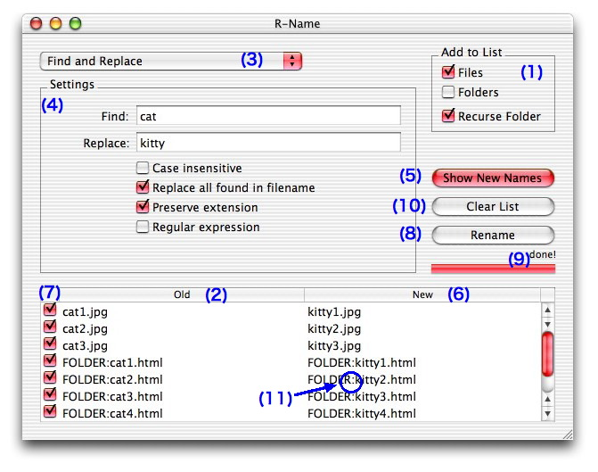

# R-Name S

#### 2018-05-18

## 0. About R-Name
R-Name allows you to quickly rename multiple files and folders. R-Name has several ways to rename files: you can find and replace characters in the filename, add and delete characters to filename, make sequentially-numbered files, and more (see Section 5 for full details).

## 1. Requirements
Mac OS X 10.2 and an HFS+ formatted volume.
(If you have UFS volumes, don't use the character `/' in filenames.)

## 2. Known Bugs
File comments will be destroyed.
Custom icons of folders disappear if you rename the invisible "Icon" files in the folders.

## 3. Installation
Move R-Name to the Applications folder or another location if you prefer.

## 4. How To Use



You can select whether R-Name should rename Files or Folders (or both) when they are dropped onto the icon by making the appropriate selections in the “Add to List” box(1).

Drag the files or folders to be renamed onto the R-Name icon or window. The files and folders are added to the column “Old"(2).

Select a renaming option from the pop-up menu(3) and make selections under the “Settings” heading(4).

Click the “Show New Names” button(5) to preview the new filenames(6) and uncheck(7) any file you do not want to rename.

If the new names are okay, click the “Rename Now” button(8) to change the checked names. Otherwise, change the settings or clear the list (click the “Clear List” button(10)), and try again.

When the files have been renamed, “done!” appears above the progress bar(9).
The filenames are not changed permanently until the “Rename” button is pressed.

Files or folders in subfolders are added to the list if “Recurse Folder”(1) is checked.
The “:” character in the list(11) shows folder hierarchy.

## 5. Kinds Of Renaming

#### Find and Replace

You can find and replace characters in filenames with this method.

If “Replace all found in filename” is checked, R-Name will replace all instances of the characters that you set to find.
Example: filename “abcabc” changes to “xyzxyz” if you find “abc” and replace it with “xyz”.

If it is not checked, R-Name will only change the first instance of the characters.
Example: filename “abcabc” changes to “xyzabc” if you find “abc” and replace it with “xyz”.

If “Case insensitive” is checked, R-Name ignores the cases.
If “Preserve extension” is checked, R-Name does not touch extensions.

If "Regular expression" is checked, you can use Perl regular expressions. “Case insensitive” and “Preserve extension” correspond to the i and g options in Perl. See section 10 if you want to know more about regular expressions.

#### Number Sequentially

This method makes sequentially-numbered filenames.

If “Preserve extension” is checked, R-Name does not touch extensions.
With the “Sort" menu you may sort the list of items you need to rename. With MacOSX 10.1 version, you can not sort by file-creation dates.

Example1: photo001.jpg, photo002.jpg, photo003.jpg (“Min. digits” option set to “3”).
Example2: photo0001.jpg, photo0002.jpg… photo1000.jpg (“Leading zeros” option checked).
Example3: photo5.jpg, photo6.jpg, photo7.jpg (“First number” set to “5”).
Example4: photo1.jpg, photo3.jpg, photo5.jpg (“Step value" set to “2”).

**Tips**
By dropping files one-by-one you can explicitly set the ordering of files for cases when it cannot be done from the sort menu.

#### Add Characters at Beginning

This method adds characters at the beginning of filenames.

#### Add Characters before Extension

This method adds characters before the filenames’ extension(s).

#### Add Characters at End

This method adds characters at the end of filenames.

#### Remove Characters from Beginning

This method removes characters positioned at the head of filenames.
If “Preserve extension” is checked, R-Name does not touch extensions.

#### Remove Characters from End

This method removes characters positioned at the tail of filenames.
If “Preserve extension” is checked, R-Name does not touch extensions.

#### Remove Characters at Range

This method removes characters positioned at the range of filenames.
If “Preserve extension” is checked, R-Name does not touch extensions.

#### Change Characters to all Uppercases

This method converts filenames to all UPPERCASEs.
If “Preserve extension” is checked, R-Name does not touch extensions.

#### Change Characters to all Lowercases

This method converts filenames to all lowercases.
If “Preserve extension” is checked, R-Name does not touch extensions.

#### Change Characters to Capitalized words

This method converts filenames to Title Cases.
If “Preserve extension” is checked, R-Name does not touch extensions.

#### Add Extension

This method adds an extension to the filenames, such as “jpg”.
Select a extension from pull down list or fill a extension in the blank.
You can edit the extensions list from Preferences.

#### Replace Extension

This method replaces the filenames’ current extension(s) with one you provide.
If a filename doesn’t have extension, the new extension is simply added to the filename.

#### Remove Extension

This method removes any extension from the filenames.

## 6. Preferences

#### When renaming files finishes

Chose the action you like when renaming files is completed.

#### Window transparency

Set transparency of windows by the slider.

#### Extensions

You can edit the extensions list which appears in “Add Extension", “Replace Extension", and “Number Sequentially".

Put an extension in a line.

Use spaces as separators like this: “   ".

## 7. Version History
ver3 [2003/7/1]
The new icon.
Disabled "Rename Now" when no items to rename are in the list.

ver2.0.1 [2003/2/19]
Fixed bug that preferences file were not loaded.
UNICEF menu is added.

ver2.0 [2002/12/5]
Transparent window.
"Find and replace" using Regular expressions.
Changing cases.
Removing characters.
Selecting items you want to rename by checkboxes.

ver1.2 [2002/9/12]
Runs under MacOS X 10.2
Transparent window is temporally unavailable.

ver1.1.1 [2002/5/6]
Transparent window.
Dropping files onto WINDOW.
Clearing the files list automatically.

ver1.1 [2002/4/21]
French localization.
Preferences are added.
Combo box for extensions.
Sorting by date or size.
Some bugs are fixed.

ver1.0.3c [2002/4/18]
Fixed a bug about space character ' '.

ver1.0.3b [2002/4/17]
This document is fixed.

ver1.0.3 [2002/4/17]
License is changed. See license in readme.
You can drop files after R-Name is launched.
You don’t have to quit to rename a second group of files.
You can clear the new and old files list.
Recursing folder.
You can rename only files or only folders.
“/” is okay for filename’s character.
Progress bar came back.

ver1.0.2 [2002/4/15]
Show a sheet when all files have been renamed.
This readme became better.
I removed the progress bar because R-Name is too fast.

ver1.0.1 [2002/4/9]
Modified main window to remember its size and location.
Modified sequential number pane to set some numbers by clicking.

ver1.0 [2002/4/9]
First release.

## 8. License
This program is free software; you can redistribute it and/or modify it under the terms of the GNU General Public License as published by the Free Software Foundation; either version 2 of the License, or any later version. This program is distributed in the hope that it will be useful, but WITHOUT ANY WARRANTY; without even the implied warranty of MERCHANTABILITY or FITNESS FOR A PARTICULAR PURPOSE.  See the GNU General Public License for more details. (See the file named LICENSE.txt.)

## 9. Special Thanks
Matt Anton for French localization # ouebmestre@syrius.org #  http://www.syrius.org/
René Adrian for the great icon # ra@xmnr.net # http://www.xmnr.net/
Roy McCoy for English correction
Carsten Klapp for English correction

## 10. Regular Expression References

There are some websites that show how to use regular expression, such as:

Perl Regular Expression Tutorial <http://www.english.uga.edu/humcomp/perl/regex2a.html>
    in English@UGA <http://www.english.uga.edu/>

Perl Regular Expression Quick Reference 1.0.2 <http://www.erudil.com/preqr.pdf>
    in Erudil - Stephen B. Jenkins <http://www.erudil.com/>

A Tao of Regular Expressions <http://sitescooper.org/tao_regexps.html>
    in Sitescooper <http://sitescooper.org/>

Copyright (c) 2018 Pedro fp
