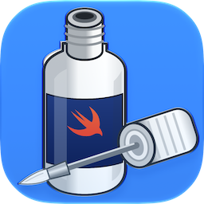

# R-Name S

Once upon a time there was a really neat file renaming utility called R-Name. Then Apple dropped support for PPC emulation in OS X, but the original developer wasn't maintaining R-Name anymore. Someone had picked up the source code so they released it as a Universal Binary (R-Name UB).

Now I can't even find a recent R-Name online, but I have the source code of the version I currently use. This project is to recreate R-Name in pure [Swift](https://swift.org) code.

## Current Status

R-Name S is now a working native SwiftUI macOS application. It can add files and folders, preview proposed names, selectively enable or disable rows, detect naming conflicts, and execute safe batch renames.

Implemented operations include find/replace (plain text or regular expression), sequential numbering, case conversion, adding text, removing characters from an edge or range, and adding/replacing/removing extensions. The original name, size, modification-date, and creation-date sort modes are also available.

Open `R-Name S.xcodeproj` in Xcode and run the `R-Name S` scheme. The current target is an Apple Silicon (`arm64`) application for macOS 14 or later. The app sandbox permits read/write access only to files and folders explicitly selected or dropped by the user.

The `z_gitignore` folder is intentionally excluded from Git. It retains historical Objective-C sources, the incomplete earlier Swift conversion, Interface Builder files, and other development references.

### Steps

1. Clone R-Name as a Swift application leaving the whole application design alone.
2. Revise & update the UI.
3. Look at possible new features.

### UNICEF / MSF

In keeping with the spirit of Yoichi Tagaya's work, R-Name S will be donationware. However I have decided to make [MSF](http://www.msf.org/) the benificiary of R-Name S.

### New Feature Ideas

- Operation history.
- Saved operations.
- Name conflict resolution.

### [Original R-Name Usage Guide](./Documentation/Usage.md)

The linked guide documents the historical application and remains useful as a feature-parity reference; screenshots, system requirements, Perl-regex notes, and some preferences do not describe the current SwiftUI build.

Copyright (c) 2018 Pedro Plowman (as pSquared/p2)
